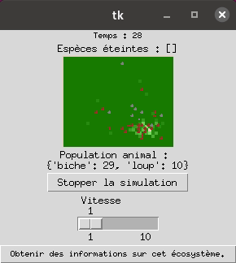

# Ecosystème

A game of life inspired simulation where dears and wolves are wandering in grassland eating each other.





## Installing for developpement
With conda
```
git clone https://github.com/Chthi/ecosysteme
cd ecosysteme
conda env create --file requirements.txt -n ecosysteme
conda activate ecosysteme
pip install --editable ./
```

## Usage
```
python -m ecosysteme
```


_______________________________________________________

Author : Thibault Charmet

Creation date : 2017

